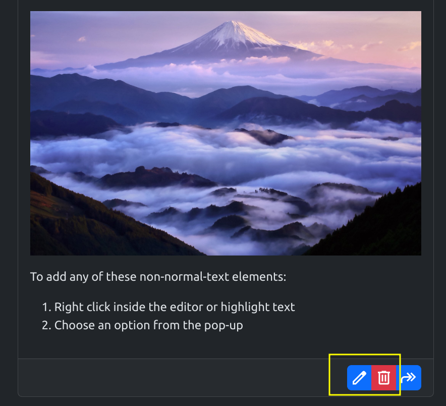

# Project 5 - Advanced Front End (React)

Project 5 is an online blogging platform. Users can post rich text, including inline images and links, and can comment on others' as well as their own posts. Comments can be responded to. Responses are shown in a tree underneath the comment they were a response to. Posts can be reblogged, in which case the body of the reblogged post is used as the basis for the content of the new post.

The live site can be viewed [here](https://project-5-dplackov-3323765a0d3d.herokuapp.com/).

## Contents

- [Objective](#objective)
- [User Stories](#user-stories)
- [Project Management](#project-management)
- [Front End](#front-end)
  - [Components](#components)
    - [Avatar](#avatar)
    - [Comment](#comment)
    - [CommentCreateForm](#commentcreateform)
    - [CommentEditForm](#commenteditform)
    - [Editor](#editor)
    - [EditorPage](#editorpage)
    - [MainNavBar](#mainnavbar)
    - [NavElement](#navelement)
    - [Notification Container](#notification-container)
    - [Post](#post)
    - [PostDetail](#postdetail)
    - [PostDetailPage](#postdetailpage)
    - [PostForm](#postform)
    - [PostsList](#postslist)
    - [Profile](#profile)
    - [Reblog](#reblog)
    - [SignInForm](#signinform)
    - [SignUpForm](#signupform)
  - [Testing](#testing)
    - [Accessibility](#accessibility)
    - [Components](#components-1)
      - [Avatar](#avatar-1)
      - [Comment](#comment-1)
      - [CommentCreateForm](#commentcreateform-1)
        - [Unresolved Bugs](#unresolved-bugs)
      - [CommentEditForm](#commenteditform-1)
        - [Unresolved Bugs](#unresolved-bugs-1)
      - [Editor](#editor-1)
        - [Unresolved Bugs](#unresolved-bugs-2)
      - [EditorPage](#editorpage-1)
      - [MainNavBar](#mainnavbar-1)
        - [Unresolved Bugs](#unresolved-bugs-3)
      - [NavElement](#navelement-1)
      - [Notification Container](#notification-container-1)
      - [Post](#post-1)
      - [PostDetail](#postdetail-1)
      - [PostDetailPage](#postdetailpage-1)
      - [PostForm](#postform-1)
        - [Unresolved Bugs](#unresolved-bugs-4)
      - [PostsList](#postslist-1)
      - [Profile](#profile-1)
      - [Reblog](#reblog-1)
      - [SignInForm](#signinform-1)
      - [SignUpForm](#signupform-1)
    - [Browser Compatiblity](#browser-compatiblity)
  - [Technologies Used](#technologies-used)
    - [Other Resources](#other-resources)
- [Back End](#back-end)
  - [Models](#models)
  - [Testing](#testing-1)
  - [PEP8 Validation](#pep8-validation)
  - [Technologies Used](#technologies-used-1)
- [Deployment](#deployment)
- [Acknowledgments](#acknowledgments)

## Objective

For my final project, I wanted to create a blogging platform similar to the one presented in the Moments walkthrough project, but different in several important respects: I wanted the posts to consist of rich text that can be edited in ways similar to real platforms like X or Reddit, as well as to allow reblogging (quoting existing posts and building on them) and responding to comments.

## User Stories

I formulated the requirements for the project as user stories, also visible as individual issues in my repo. Most have been implemented, except for Likes and Follows, due to time constraints.

| User Type      | User Story                                                           | Implemented |
| -------------- | -------------------------------------------------------------------- | ----------- |
| Logged-in User | Delete Post: Remove content they no longer want displayed            | ✓           |
| Logged-in User | Edit Post: Change the content of their posts                         | ✓           |
| User           | Delete Comments: Remove comments they no longer want displayed       | ✓           |
| Logged-in User | Edit Comments: Fix typos or update comment content                   | ✓           |
| User           | Respond to Comments: Continue thread discussions under posts         | ✓           |
| User           | Infinite Scroll: Browse posts and comments without page switching    | ✓           |
| Logged-in User | Reblog Posts: Build on existing posts with new content               | ✓           |
| Logged-in User | Follow Users: Filter posts and comments by followed users            | ✗           |
| User           | Error Handling: See server-returned errors in a toast container      | ✓           |
| User           | Profile View: View individual user's posts and comments              | ✓           |
| User           | Search Function: Find posts and profiles easily                      | ✓           |
| Logged-in User | Likes: Express interest in posts by liking/unliking                  | ✗           |
| User           | Post Detail View: See individual post comments and statistics        | ✓           |
| User           | Comment Function: Interact with posters by leaving comments          | ✓           |
| Logged-in User | Image Upload: Add images to posts via Cloudinary                     | ✓           |
| Logged-in User | Create Post: Contribute content to the platform                      | ✓           |
| User           | Full Post List: View all posted content                              | ✓           |
| User           | Log Out Functionality: Disconnect account from current session       | ✓           |
| User           | Sign In Functionality: Access account and post as authenticated user | ✓           |
| User           | Sign Up Functionality: Create a new account to enable posting        | ✓           |

## Project Management

I used a Project and a Kanban board on my GitHub to track progress on my project.

The Project can be viewed [here](https://github.com/users/DajanPlackovic/projects/4/views/1).

## Front End

### Components

#### Avatar

A simple component displaying either only the user's profile image or their image, username and handle, depending on the props passed in.

#### Comment

A single comment. It displays the content of the comment to all users as well as:

- For any logged in user, it shows the option to respond.

  

- For the author, it shows the option to delete or edit.

  

If there are responses, they are shown below the main body of the comment.

If the option to edit is clicked, the [CommentEditForm](#commenteditform) component is rendered inside the body of the comment.

If the option to respond is clicked, the [CommentCreateForm](#commentcreateform) component is rendered just below the main body of the comment.

If the comment is deleted, it is soft deleted by changing its text to DELETED. (This is to preserve the comment tree, in case there is a response).

#### CommentCreateForm

The form to create a new comment. It renders an [Editor](#editor) component with `post` set to false.

If a comment to be responded to is not passed to it, only the button to post the comment is shown.

If a comment to be responded to is passed, the button to cancel is also displayed. Clicking it sets the `responding` state to false.

#### CommentEditForm

Renders a header with a button to post and an [Editor](#editor) component with `post` set to false prefilled with the comment text that has been passed to it.

#### Editor

A wrapper around a Quill instance that allows for richtext editing. Right clicking inside the component or selecting text shows additional editing options, such as setting a part of the text as a heading, setting the formatting to bold, italic, underlined or strikethrough, or adding links or images.

It can be passed a boolean `post` value, which is `false` by default. The `post` value determines which options are displayed. If `post` is set to true, the option to set headings, as well as upload images is displayed. These options are otherwise removed.

There is an image handler which hits an `upload` route in case an image is added to the post. This sends a request to the server to upload the image to cloudinary. The url of the image is then returned and inserted dynamically into the Editor.

The component can also be passed a `defaultValue` html string, which is parsed and inserted into the Editor on mount.

#### EditorPage

Renders a [PostForm](#postform) component inside a react-bootstrap Card component styled to resemble a [Post](#post) component.

#### MainNavBar

The sticky navbar at the top of each page.

In any state, it displays the button to toggle between the dark and light themes. Toggling changes the appearance of the website, as well as saves the user preference in local storage so that it persists across sessions in the same browser.

If the user is not logged in, a button to log in also displayed.

If the user is logged in, a button to add a new post is displayed, as well as the user's profile image. Clicking on the profile image displays a dropdown with options to go to one's own profile or log out.

#### NavElement

The component wraps buttons in the [MainNavBar](#mainnavbar). It takes `symbol` and `hint` as props.

On larger screens, it renders only the symbol, with the hint added inside a tooltip displayed on hover.

On smaller screens, the hint is added directly to the body of its child element.

#### Notification Container

An invisible react-boostrap ToastContainer component sticking to the top of the screen.

On most edit, delete and post actions, it displays a notification at the top of the screen which disappears automatically after a short delay.

In case of any error with a status code different to 404, an error message is displayed inside a toast at the top of the screen. Errors do not disappear automatically and have to be dismissed.

#### Post

Renders a single post, applying the various formatting options, images and links.

Any logged in user also sees the option to reblog at the bottom.

The author additionally sees the option to edit or delete the post.

Editing the post renders a [PostForm](#postform) component inside the body of the post prefilled with the contents of the post.

Deleting the post soft-deletes it and redirects to the home page is the user is viewing the [PostDetail](#postdetail) page or removes the post from the state of the page if it is deleted inside the [PostsList](#postslist) component. (The soft deletion ensures that any posts that reblogged the post are still rendered correctly, merely showing the text "DELETED" in the place where the deleted post used to be.)

If the post reblogged another post, that post and any posts the reblogged post was a reblog of are displayed inside the post body above the main content.

Additionally, each post contains a link to its [PostDetail](#postdetail) page when it is displayed inside a [PostsList](#postslist) element.

#### PostDetail

Renders a single post in a [Post](#post) component with all its comments underneath in [Comment](#comment) components. The total number of comments is displayed above the list of comments.

If the user is not logged in, a button prompting them to log in is displayed above the comments.

If the user is logged in, a [CommentCreateForm](#commentcreateform) is rendered at the top instead.

#### PostDetailPage

Renders the [PostDetail](#postdetail) components inside the PostContext.Provider to reduce props passing when deleting comments.

#### PostForm

Renders an [Editor](#editor) component with `post` set to `true` and buttons to post or cancel at the bottom. The cancel button changes the `edit` state in case the setter has been passed to the component and otherwise navigates back. The post button creates or edits the post depending on its props.

#### PostsList

Renders a list of [Post](#post) components inside an InfiniteScroll component. A search bar is also displayed at the top and allows for searching the posts by the username of the author or the contents of the html.

#### Profile

Displays a user [Avatar](#avatar) with a [PostsList](#postslist) component at the bottom filtered only to the user's posts. The total number of comments and posts by the user is also displayed.

#### Reblog

A component rendering a reblogged post. It always links to the [PostDetailPage](#postdetailpage) of the reblogged post and never displays the options to edit or delete the post (this needs to be done after going to the [PostDetailPage](#postdetailpage)).

#### SignInForm

A sign in form. There are fields for the username and the password. At the bottom is a link to the [SignUpForm](#signupform).

#### SignUpForm

A sign up form. There are fields for the username and the password, as well as one to confirm the password.

### Testing

#### Accessibility

User-uploaded images in posts do not have an `alt` attribute, which is flagged by Lighthouse and is the only unresolved accessibility issue.

| Page                                                                                | Lighthouse Result                                                          |
| ----------------------------------------------------------------------------------- | -------------------------------------------------------------------------- |
| [Home](https://project-5-dplackov-3323765a0d3d.herokuapp.com/)                      |                     |
| [Post Detail Page](https://project-5-dplackov-3323765a0d3d.herokuapp.com/posts/78/) |  |
| [Profile Page](https://project-5-dplackov-3323765a0d3d.herokuapp.com/profiles/10)   |          |
| [Editor Page](https://project-5-dplackov-3323765a0d3d.herokuapp.com/editor-page)    |       |

#### Components

##### Avatar

| Test                                                                                               | Pass |
| -------------------------------------------------------------------------------------------------- | ---- |
| The component correctly displays the passed profile image                                          | ✓    |
| The component correctly displays the passed author name and handle if `img_only` is set to `false` | ✓    |
| The component displays a spinner until the profile image is available                              | ✓    |

##### Comment

| Test                                                                                                                               | Pass |
| ---------------------------------------------------------------------------------------------------------------------------------- | ---- |
| The comment body is correctly displayed                                                                                            | ✓    |
| Any responses are added to the comment body                                                                                        | ✓    |
| The option to respond is shown to logged-in users                                                                                  | ✓    |
| The option to respond is not shown to logged-out users                                                                             | ✓    |
| Clicking on the option to respond displays a [CommentCreateForm](#commentcreateform) inside the comment body above other responses | ✓    |
| The option to edit or delete is shown to the author                                                                                | ✓    |
| The option to edit or delete is not shown to other users                                                                           | ✓    |
| Clicking on the option to edit displays a [CommentEditForm](#commenteditform) component inside the comment body                    | ✓    |
| The [CommentEditForm](#commenteditform) is prepopulated with the contents of the comment                                           | ✓    |
| If the comment is edited, the content updates after submission                                                                     | ✓    |
| If the comment is deleted, its text is changed to "DELETED"                                                                        | ✓    |
| A notification is pushed on edit or on deletion                                                                                    | ✓    |

##### CommentCreateForm

| Test                                                                                          | Pass |
| --------------------------------------------------------------------------------------------- | ---- |
| Right-clicking or selecting text displays only the comment editing options                    | ✓    |
| Applying formatting or adding a link changes the appearance of the text                       | ✓    |
| Submitting the form creates a new comment                                                     | ✓    |
| In case of responses, the comment is correctly associated with the comment being responded to | ✓    |
| Cancelling in the case of responses hides the form                                            | ✓    |

###### Unresolved Bugs

- It is possible to post an empty comment. I could not resolve this issue, as the validation of QuillFields and an html field introduces additional complexity, since empty submissions still have content (a JSON object with no steps in the case of the QuillField and several empty HTML tags in the case of the html field).

##### CommentEditForm

| Test                                                                       | Pass |
| -------------------------------------------------------------------------- | ---- |
| Right-clicking or selecting text displays only the comment editing options | ✓    |
| Applying formatting or adding a link changes the appearance of the text    | ✓    |
| Submitting the form updates the comment content                            | ✓    |

###### Unresolved Bugs

- Comments can likewise be edited to remove all content. See above.

##### Editor

| Test                                                                                                            | Pass |
| --------------------------------------------------------------------------------------------------------------- | ---- |
| Entering text into the Editor updates the state                                                                 | ✓    |
| Formatting options are correctly displayed on selection or right click                                          | ✓    |
| On image upload, the image is uploaded to cloudinary and the correct URL is returned and inserted into the body | ✓    |

###### Unresolved Bugs

- In some cases, the cursor does not move past the image after it is added, making any text entered into the Editor appear before the image rather than after it. I could not determine the commonality in such cases and consequently was not able to resolve the issue.

##### EditorPage

| Test                                                                              | Pass |
| --------------------------------------------------------------------------------- | ---- |
| The [PostForm](#postform) component is correctly rendered inside a Card component | ✓    |

##### MainNavBar

| Test                                                                                                   | Pass |
| ------------------------------------------------------------------------------------------------------ | ---- |
| Clicking on the text "Project 5" takes the user to the home page                                       | ✓    |
| The component always displays the toggle theme button                                                  | ✓    |
| The toggle theme button changes the hint and symbol depending on the current theme                     | ✓    |
| Toggling the theme changes the appearance of the site                                                  | ✓    |
| The theme persists across sessions in the same browser                                                 | ✓    |
| If the user is not signed in, the component displays the sign in button                                | ✓    |
| Clicking on the sign in button takes the user to the sign in page                                      | ✓    |
| If the user is signed in, the component displays the profile image and the add post button             | ✓    |
| Clicking on the profile image shows a dropdown with the options to log out and visit one's own profile | ✓    |
| Clicking on the Add Post button takes the user to the editor page                                      | ✓    |
| Clicking on the Log Out button logs the user out                                                       | ✓    |
| Clicking on the Go to Profile button takes the user to their profile page                              | ✓    |

###### Unresolved Bugs

- Clicking on either of the elements in the profile options dropdown highlights both. The highlight remains even after the user has navigated to another page.

##### NavElement

| Test                                                                                     | Pass |
| ---------------------------------------------------------------------------------------- | ---- |
| The symbol and tooltip are correctly displayed on larger screens                         | ✓    |
| The symbol and hint are correctly displayed on smaller screens inside the hamburger menu | ✓    |

##### Notification Container

| Test                                                                                                 | Pass |
| ---------------------------------------------------------------------------------------------------- | ---- |
| Raising an error causes the error to be displayed in a toast except on the sign in and sign up pages | ✓    |
| The error must be dismissed and does not hide on its own                                             | ✓    |
| Pushing a notification causes the notification to be displayed in a toast                            | ✓    |
| The notification disappears after a short delay                                                      | ✓    |

##### Post

| Test                                                                                                                                     | Pass |
| ---------------------------------------------------------------------------------------------------------------------------------------- | ---- |
| The contents of the post are correctly rendered, including images                                                                        | ✓    |
| Reblogged posts display posts they are based on inside their body                                                                        | ✓    |
| Clicking on the link to the post detail page takes the user to the correct page                                                          | ✓    |
| Clicking on the author avatar takes the user to their profile page                                                                       | ✓    |
| The reblog button is displayed to logged-in users                                                                                        | ✓    |
| The reblog button is not displayed to logged-out users                                                                                   | ✓    |
| Clicking on the reblog button takes the user to the editor-page, with the Editor component prepopulated with the list of reblogged posts | ✓    |
| The edit and delete buttons are displayed to the post author                                                                             | ✓    |
| The edit and delete buttons are not displayed to other users                                                                             | ✓    |
| Clicking on the edit post button correctly renders the [PostForm](#postform) component prepopulated with the contents of the post        | ✓    |
| After the edit is submitted, the displayed content is updated correctly                                                                  | ✓    |
| Clicking on the delete post button on the post detail page deletes the post and takes the user to the home page                          | ✓    |
| Clicking on the delete post button on the post list page deletes the post and removes it from the displayed list                         | ✓    |
| Deleting a post does not break any reblogs                                                                                               | ✓    |

##### PostDetail

| Test                                                                                              | Pass |
| ------------------------------------------------------------------------------------------------- | ---- |
| The [Post](#post) component is correctly rendered                                                 | ✓    |
| Comments related to the post are correctly rendered in [Comment](#comment) components             | ✓    |
| Logged-out users are shown a button taking them to their sign in page above the comments          | ✓    |
| Logged-in users are shown a functional [CommentCreateForm](#commentcreateform) above the comments | ✓    |
| If a new comment is created, the displayed post comment count is correctly increased by one       | ✓    |

##### PostDetailPage

| Test                                                                                                            | Pass |
| --------------------------------------------------------------------------------------------------------------- | ---- |
| The [PostDetail](#postdetail) component is correctly rendered                                                   | ✓    |
| Components lower down in the tree are provided with the necessary functions and state from the wrapping context | ✓    |

##### PostForm

| Test                                                                                                             | Pass |
| ---------------------------------------------------------------------------------------------------------------- | ---- |
| Right-clicking or selecting text displays the post editing options, including adding images and headings         | ✓    |
| Applying formatting or adding a link changes the appearance of the text                                          | ✓    |
| Submitting the form creates a new post or updates an existing post depending on the props                        | ✓    |
| In case of reblogs, the post is correctly associated with the post being reblogged                               | ✓    |
| When editing a post, the form is prepopulated with the post content                                              | ✓    |
| Cancelling navigates the user to the previous page                                                               | ✓    |
| Cancelling resets the reblog state, so that reblogging, cancelling, then adding a post does not keep the reblogs | ✓    |

###### Unresolved Bugs

- As with the comment forms, it is possible both to submit an empty form and to edit a post so that it is empty.

##### PostsList

| Test                                                                                  | Pass |
| ------------------------------------------------------------------------------------- | ---- |
| On load, the list of all posts in descending order of creation date is displayed      | ✓    |
| Searching for a post by the author's name or post content correctly filters the posts | ✓    |
| A network error is raised if the server is unavailable                                | ✓    |

##### Profile

| Test                                                                      | Pass |
| ------------------------------------------------------------------------- | ---- |
| The [Avatar](#avatar) of the user is correctly displayed                  | ✓    |
| The post and comment counts are displayed correctly                       | ✓    |
| The [PostsList](#postslist) component is displayed and filtered correctly | ✓    |

##### Reblog

| Test                                                                          | Pass |
| ----------------------------------------------------------------------------- | ---- |
| The content of the reblogged post is correctly displayed                      | ✓    |
| The link to the reblogged post leads the user to the correct post detail page | ✓    |

##### SignInForm

| Test                                                                          | Pass |
| ----------------------------------------------------------------------------- | ---- |
| The form with username and password fields is correctly displayed             | ✓    |
| Submitting the form with correct data signs the user in                       | ✓    |
| Submitting the form with correct data navigates the user to the previous page | ✓    |
| Submitting the form with incorrect data renders errors under the inputs       | ✓    |
| Clicking on the Sign Up link at the bottom takes the user to the sign up page | ✓    |

##### SignUpForm

| Test                                                                               | Pass |
| ---------------------------------------------------------------------------------- | ---- |
| The form with username and two password fields is correctly displayed              | ✓    |
| Submitting the form with correct data creates a user profile and signs the user in | ✓    |
| Submitting the form with correct data navigates the user two pages back            | ✓    |
| Submitting the form with incorrect data renders errors under the inputs            | ✓    |
| Clicking on the Sign In link at the bottom takes the user to the sign in page      | ✓    |

#### Browser Compatiblity

All of the above tests have been performed in the following browsers:

- [Google Chrome](https://www.google.com/chrome/)
- [Mozilla Firefox](https://www.mozilla.org/en-US/firefox/new/)
- [Microsoft Edge](https://www.microsoft.com/en-us/edge/)

### Technologies Used

[React](https://react.dev/) was used to create the front end. [Create React App](https://create-react-app.dev/) was used to initialize the project. Additionally, I made use of the following packages:

- [**axios**](https://www.npmjs.com/package/axios) - Promise-based HTTP client for making API requests from the browser or Node.js
- [**html-react-parser**](https://www.npmjs.com/package/html-react-parser) - Converts HTML strings into React elements. Used to parse the HTML output of Quill
- [**jwt-decode**](https://www.npmjs.com/package/jwt-decode) - Lightweight library for decoding JSON Web Tokens (JWTs) on the client-side
- [**react-bootstrap**](https://www.npmjs.com/package/react-bootstrap) - Bootstrap components rebuilt as React components for seamless integration
- [**react-infinite-scroll-component**](https://www.npmjs.com/package/react-infinite-scroll-component) - Simple React component for implementing infinite scrolling functionality
- [**react-quill**](https://www.npmjs.com/package/react-quill) - A rich text editor component for React applications
- [**react-router-dom**](https://www.npmjs.com/package/react-router-dom) - Routing library for React applications, enabling navigation between different components

#### Other Resources

Code for Quill configuration and some functionality has been taken from online sources. They are acknowledged and linked to in the code comments.

Additionally, [favicon.io](https://favicon.io/) was used to create the favicon and [Material Design Symbols](https://fonts.google.com/icons) were used for most action buttons on the website.

## Back End

### Models

The project uses three main models: **Posts**, **Comments** and **Profiles**.

**Posts** contain a foreign key to a **User** instance and fields for the time when they were created and updated, like in the walkthrough project. Unlike in the walkthrough project, the **text** field is a Quill Delta, a JSON object posted from a Quill Editor containing a series of steps on how to reach a given current state of the Editor. The **html** field contains the **html** representation of the content of the post. The **deleted** field is a boolean indicating whether the post has been deleted (since posts are soft-deleted to preserve reblogs). The **reblogged** field is a self-referencing foreign key, which can either be null or point to another post.

**Comment** likewise contains fields for a foreign key to a **User** instance, a foreign key to a **Post** instance and fields for the creation and edit times. The **text** and **html** fields are, again, a Quill Delta and a string containing an html representation of the content respectively. The **response_to** field is a self-referencing foreign key, while the **deleted** field is a flag, same as in the **Post** model.

**Profile** has a foreign key to the **User** instance, a **handle**, a shortened and modifiable version of the username, as well as creation and edit times. There is also an **image** field for the profile image and a **slug** field for the slug.

### Testing

| Application | URL                         | Expected Result                                                                                | Pass |
| ----------- | --------------------------- | ---------------------------------------------------------------------------------------------- | ---- |
| profiles    | /profiles/&lt;int:id&gt;    | Return a single profile                                                                        | Pass |
| posts       | /posts/                     | Return a list of all posts ordered by creation date                                            | Pass |
| posts       | /posts/?search=dajan        | Return a list of all posts authored by the user dajan or containing the word dajan             | Pass |
| posts       | /posts/?author\_\_profile=8 | Return a list of all posts authored by the user dajan                                          | Pass |
| comments    | /comments/                  | Return a list of all comments ordered by creation date                                         | Pass |
| comments    | /comments/?post=20          | Return a list of all comments associated with the post with the id 20 ordered by creation date | Pass |
| upload      | /upload/                    | A post to this URL uploads an image to cloudinary and returns data including the image url     | Pass |

### PEP8 Validation

All files pass the [CI PEP8 Linter](https://pep8ci.herokuapp.com/).

### Technologies Used

The back end is written using [**Python**](https://www.python.org/) within the [**Django Rest Framework**](https://www.django-rest-framework.org/). I additionally made use of the following packages:

- [asgiref](https://pypi.org/project/asgiref/) - A standard Python package for handling asynchronous communication between web apps and servers.
- [certifi](https://pypi.org/project/certifi/) - A curated collection of Root Certificates for validating the trustworthiness of SSL certificates
- [charset-normalizer](https://pypi.org/project/charset-normalizer/) - A library for character encoding detection and normalization
- [cloudinary](https://pypi.org/project/cloudinary/) - A cloud service for managing and transforming images, videos, and other media files
- [dj-auth](https://pypi.org/project/dj-auth/) - A Django authentication package
- [dj-database-url](https://pypi.org/project/dj-database-url/) - Allows you to utilize the 12factor inspired DATABASE_URL environment variable to configure your Django application
- [dj-rest-auth](https://pypi.org/project/dj-rest-auth/) - REST API endpoints for authentication and registration
- [dj3-cloudinary-storage](https://pypi.org/project/dj3-cloudinary-storage/) - Django storage backend for Cloudinary
- [django-allauth](https://pypi.org/project/django-allauth/) - Integrated set of Django applications addressing authentication, registration, account management
- [django-filter](https://pypi.org/project/django-filter/) - A library for filtering Django QuerySets based on user-selected conditions
- [django-quill-editor](https://pypi.org/project/django-quill-editor/) - A Django Rich Text Editor using Quill.js
- [djangorestframework-simplejwt](https://pypi.org/project/djangorestframework-simplejwt/) - A JSON Web Token authentication plugin for Django REST Framework
- [gunicorn](https://pypi.org/project/gunicorn/) - A Python WSGI HTTP Server for UNIX
- [idna](https://pypi.org/project/idna/) - Internationalized Domain Names in Applications (IDNA) support
- [packaging](https://pypi.org/project/packaging/) - Core utilities for Python packaging
- [pillow](https://pypi.org/project/pillow/) - A friendly fork of PIL (Python Imaging Library) for opening, manipulating, and saving many different image file formats
- [psycopg2](https://pypi.org/project/psycopg2/) - PostgreSQL database adapter for Python
- [PyJWT](https://pypi.org/project/PyJWT/) - Library for encoding and decoding JSON Web Tokens (JWT)
- [requests](https://pypi.org/project/requests/) - A simple, yet elegant HTTP library
- [six](https://pypi.org/project/six/) - Python 2 and 3 compatibility utilities
- [sqlparse](https://pypi.org/project/sqlparse/) - A non-validating SQL parser
- [typing_extensions](https://pypi.org/project/typing-extensions/) - Backported and Experimental Type System Extensions
- [urllib3](https://pypi.org/project/urllib3/) - A powerful HTTP client library
- [whitenoise](https://pypi.org/project/whitenoise/) - Allows your web app to serve its own static files

## Deployment

Both the front end and the back end have been deployed as a monorepo to Heroku following the instructions for consolidating both projects from the Moments walkthrough project.

## Acknowledgments

- Marta, for tolerating my often changing, inconsistent and time-consuming life and career plans.

- My family, for their useful feedback and inevitable joshing.

- My tutor, Marcel, for his patience, notes, feedback, encouragement and clear, precise pointers on what to focus on in moments of total disorientation.

- Code Institute for teaching me what I needed to know to make this website.
